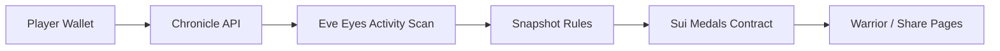
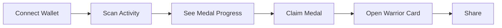

# EVE Medals Hackathon One-Pager

更新时间：2026-03-31

## One-line Punch

> `EVE Medals` 把 `EVE Frontier` 玩家真实发生过的行为，变成可验证的勋章、Warrior 档案和可分享卡片。

备选 punch line：

- `From Frontier activity to verifiable honor.`
- `Turn real Frontier actions into medals, identity, and shareable proof.`

## 当前状态

`EVE Medals` 当前更准确的定位是：

> 一个 working achievement verification and sharing product。

现在已经打通的主链路：

`行为索引 -> 成就判断 -> 勋章领取 -> Warrior 展示 -> 分享`

要主动讲清楚的边界：

- 当前 demo 展示的是 `working product loop`
- `trusted deployment alignment is in progress`
- 现在适合讲“传播入口已具备”，不适合硬讲“成熟社交增长引擎”

## 架构图

评审版解释：

- 链下负责行为索引
- 规则层负责成就判断与状态组装
- 链上负责荣誉持有证明
- 前端负责展示、回流与传播

## 用户流程图

## Demo Flow

默认现场 demo 只走这 4 步：

1. 打开 Chronicle 页面，连接一个已有样本行为的钱包
2. 展示至少一枚 medal 从 `in progress / claimable` 到 `claimed` 的状态差异
3. 跳转 Warrior 页面，证明链上持有结果已经回流为公开档案
4. 打开 share card 或 QR，证明这不是站内死页面，而是可传播对象

现场统一强调这句：

> 我们不是在发 NFT 图，我们是在把真实行为变成可验证荣誉。

## 痛点、爽点、长期规划

### 痛点

`EVE Frontier` 玩家投入很重，但缺少可验证、可长期携带、可公开展示的荣誉表达。

### 爽点

玩家可以把自己的战绩和身份做成 Warrior 卡与 Medal 卡，这东西能晒、能传、能形成身份认同。

### 长期规划

1. 更强验证出口：分享卡增加更明显的链上 proof / explorer 入口
2. 更强身份层：seasonal medals、org/team reputation、rank progression
3. 更强传播层：分享来源归因、referral、conversion funnel

## GTM

首批用户：

- `EVE Frontier` 核心玩家
- 工会 / 组织管理者
- 喜欢晒战绩的高活跃玩家

进入方式：

- Warrior 卡分享
- 单 medal 分享卡
- Discord / X 社群传播

初始指标：

- 分享次数
- 分享回流访问
- 连接钱包率
- claim 完成率

首个增长闭环：

`玩家晒卡 -> 新玩家点进 Warrior / Medal 页面 -> 连接钱包扫描 -> 发现自己也可解锁 -> 领取并继续分享`
